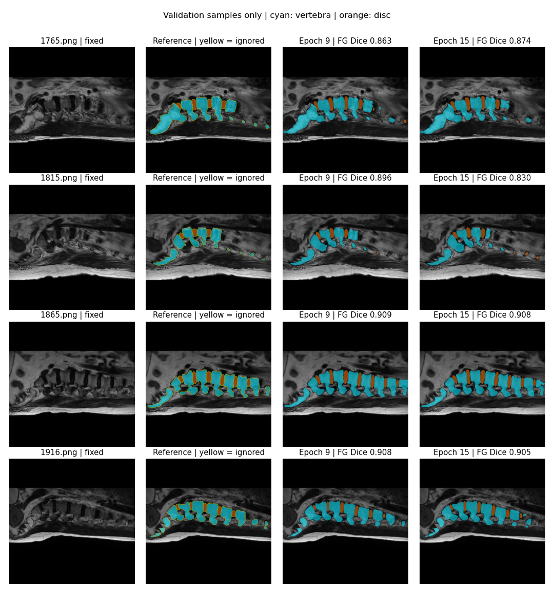

# Spine-Re · J-Unet Spinal MRI Segmentation

[简体中文](README.md) | **English**

A PyTorch project for 2D MRI image segmentation using J-Unet to classify pixels as background, vertebral bodies, or intervertebral discs. It provides a Google Colab quickstart, on-demand PNG loading, training in resumable stages, checkpoint storage on Google Drive, and evaluation outputs that can be inspected.

[](https://colab.research.google.com/github/B-jack7/Spine-Re/blob/main/notebooks/Spine_Re_Quickstart.ipynb)

## License

The maintainer's original training utilities, tests, and documentation are licensed under the [MIT License](LICENSE). See [licensing scope and provenance](docs/LICENSING.md) for the covered files. Legacy model code, MRI data, labels, and images are excluded from this grant; their provenance and licenses still need verification. The repository is not covered by a blanket MIT license.

## Quickstart: run a small smoke test first

1. Click **Open in Colab** above and optionally save a copy of the notebook to Drive.
2. In Colab, select **Runtime → Change runtime type → T4 GPU**.
3. Keep `MODE="smoke"` and select **Run all**.
4. The notebook downloads pinned versions of the data and model code, checks the metric implementation, trains for **2 epochs on 8 training images / 4 validation images / 4 test images**, and displays predictions and metrics.

The initial download takes time. This smoke test checks the workflow; it does not measure model performance. Colab GPU access depends on account quotas and resource availability. The quickstart does not purchase compute, sign you in, or bypass Google authorization. You can also inspect the code and run metric unit tests on a CPU.

## Full training and checkpoint resumption

Set the following in the notebook's configuration cell:

```python
MODE = "train"
EPOCHS = 50
PAUSE_EVERY = 15
USE_DRIVE = True
RUN_NAME = "junet_50_ignore_seed20260915"
```

Authorize Drive access on the first run. Data is read from Colab's temporary disk, while outputs are saved to `MyDrive/Spine-Re-experiments/<RUN_NAME>`.

- After each epoch: run validation, save `last.pt` and `history.jsonl`, and update `best.pt` when validation foreground Dice improves.
- At epochs **15, 30, and 45**: also save a full checkpoint such as `epoch_015.pt`, then pause.
- After reviewing validation results, run the training cell again to resume the next stage from the same directory.
- At epoch **50**: save a checkpoint and run the final test using the model selected on the validation set.

To stop early, click the training cell's stop button. The notebook terminates its training subprocess and releases the GPU memory used by that subprocess. An incomplete epoch is not saved; resumption starts from the latest complete checkpoint. Cleanup requires the notebook kernel to remain alive and cannot run if the runtime is forcibly deleted. A network disconnection or a page showing “Connecting” does not mean training has stopped.

If the GPU session is reclaimed, reopen the notebook, connect to a GPU, and mount the same Drive. Keep the same code, configuration, and `RUN_NAME`. The notebook automatically detects `last.pt`; it refuses to resume if code hashes or key settings differ, preventing different experiments from being mixed. Use a new `RUN_NAME` for a new experiment. Only load weight files you created yourself or obtained from a trusted source.

## Repository layout

| Path | Purpose |
|---|---|
| `notebooks/Spine_Re_Quickstart.ipynb` | Colab quickstart and full training entry point |
| `reproduce/train.py` | Lazy PNG loading, training, validation, checkpoints, and final testing |
| `reproduce/metrics.py` | Label decoding, confusion matrices, per-class and aggregate metrics |
| `reproduce/test_core.py` | Tests against hand-calculated metrics and unknown-label handling |
| `reproduce/audit.py` | Checks for image/label pairing, dimensions, duplicate images, and label colors |
| `J-Unet网络结构部分代码及注释说明/` | Original model implementation, PNG data, and historical scripts |
| `docs/RESULTS.md` | Settings, metrics, and validation examples from completed runs |

The newer entry point retains the directory name `reproduce/` and is the recommended way to run experiments. Historical training scripts in the original directory use different defaults.

## Model and default configuration

The J-Unet implementation is in `J-Unet网络结构部分代码及注释说明/J-Unet/nets/unet3plus.py`, under the class name `UNet_3Plus`. It takes **512 × 512 RGB** input and outputs logits for three classes. The implementation has **25,659,999 parameters** and **180 decoder channels**. The training entry point also supports the repository's UNet baseline (`--model unet`).

| Setting | Default |
|---|---|
| Optimizer / learning rate | Adam / 0.0001 |
| Batch size | 2 |
| Loss | Three-class soft Dice loss |
| Random seed | 20260915 |
| GPU precision | Mixed precision; disable with `--no-amp` |
| Input processing | RGB conversion and ImageNet mean/std normalization; labels are not resized |
| Model selection | Foreground Dice computed from the global confusion matrix over the full validation set |

## Data and labels

The repository contains **2,523 PNG pairs**: 1,764 training / 253 validation / 506 test pairs, all at 512 × 512. Images and labels are paired by matching filenames.

| PNG pixel value (identical in all RGB channels) | Class ID | Class |
|---|---:|---|
| 0 | 0 | Background |
| 100 | 1 | Vertebral body |
| 255 | 2 | Intervertebral disc |

Approximately **1.6%–1.7%** of label pixels have other colors. The default `--label-policy ignore` excludes them from both loss and metrics; `legacy-background` maps them to background. Results from the two policies are not directly comparable, and ignoring unknown pixels may increase scores.

The available files do not include original NIfTI volumes or patient identifiers, so patient independence across training, validation, and test sets cannot be verified. Label provenance and boundary accuracy have not been independently confirmed. Results describe performance on the current PNG split and do not establish clinical suitability. Check the relevant usage permissions before sharing or replacing data.

## Interpreting the metrics

- `dice_per_class` / `iou_per_class`: background, vertebral body, and intervertebral disc, in that fixed order.
- `dice_macro_foreground` / `miou_foreground`: the mean over vertebral body and intervertebral disc, excluding background.
- `dice_macro_all` / `miou_all`: the mean over all three classes, including background.
- Top-level metrics are computed after accumulating a confusion matrix across all valid pixels. `image_macro_averages` instead averages scores calculated separately for each image.
- Always report whether unknown label pixels are ignored, whether background is included, how scores are aggregated, and whether results come from validation or testing.

**Recorded runs:** one 3-epoch run using the full training split with testing on 506 images, and a separate 15-epoch training stage, have been completed. In the latter run, the best validation epoch was epoch 9, with foreground Dice of 0.9214; this is not a test-set result. See [run records and predictions](docs/RESULTS.md).



## Local use / other GPU environments

```bash
git clone https://github.com/B-jack7/Spine-Re.git
cd Spine-Re
python -m pip install -r reproduce/requirements.txt
python reproduce/test_core.py

# Small workflow smoke test
python reproduce/train.py --output runs/smoke --epochs 2 --train-limit 8 --val-limit 4 --test-limit 4

# Full training, pausing first at epoch 15
python reproduce/train.py --output runs/junet_50 --epochs 50 --pause-every 15

# Resume the next stage with the same environment, code, and settings
python reproduce/train.py --output runs/junet_50 --epochs 50 --pause-every 15 --resume
```

Use a CUDA-enabled PyTorch installation. If GPU memory is insufficient, reduce `--batch-size` for a new experiment, but do not mix a run with a changed batch size into an existing experiment. Long CPU training is blocked by default to prevent accidental use. To intentionally run on a CPU, add `--allow-cpu`; training will be substantially slower.

### Quick checks after code changes

These checks require only a CPU and also run in GitHub Actions. No dataset download or PyTorch installation is needed:

```bash
python -m pip install numpy Pillow
python reproduce/test_core.py
python -m unittest discover -s tests -v
python scripts/check_notebooks.py
```

The checks cover metrics, interruption cleanup for the training subprocess, and consistency between the two Colab entry points and their embedded source code. When changing training source files, update the copies embedded in both notebooks as well. Resuming an existing experiment still requires matching training source hashes.

## Output files

`config.json` records settings, versions, and code hashes; `history.jsonl` records per-epoch loss and validation metrics; `last.pt` is used for resumption; and `best.pt` holds the model selected on validation performance. Final testing produces `test_metrics.json`, `test_per_image.json`, and `predictions/`. If Drive saving is disabled, files under Colab's `/content` are lost when the runtime is reclaimed; download the ZIP archive before that happens.

Pinned model and data versions, random seeds, and run configurations are recorded, but bit-for-bit numerical agreement is not guaranteed across hardware, PyTorch versions, or mixed-precision settings. No pretrained weights are currently published for download; this entry point trains from scratch. The example metrics do not imply that opening the notebook will immediately reproduce the same scores.
