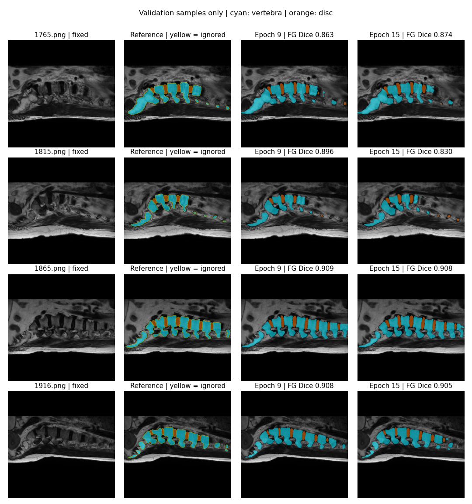

# Spine-Re · J-Unet 脊柱 MRI 分割

基于 PyTorch 的二维 MRI 图像分割项目，使用 J-Unet 将图像分为背景、椎体和椎间盘三类。提供 Google Colab 快速运行、按需加载 PNG、分段训练、Drive 断点保存和可核查的评估输出。

[](https://colab.research.google.com/github/B-jack7/Spine-Re/blob/main/notebooks/Spine_Re_Quickstart.ipynb)

## 快速开始：先跑通一个小实验

1. 点击上方 **Open in Colab**，按需要在 Drive 保存一份笔记本。
2. 在 Colab 菜单选择 **代码执行程序 / 运行时 → 更改运行时类型 → T4 GPU**。
3. 保持 `MODE="smoke"`，选择 **全部运行**。
4. 程序会下载固定版本的数据和模型代码，检查指标实现，用 **8 张训练图 / 4 张验证图 / 4 张测试图训练 2 轮**，然后展示预测图与指标。

首次下载需要时间；小实验用于检查流程，不用于衡量模型性能。Colab GPU 取决于账号额度与资源可用性；“一键入口”不会自动购买算力、自动登录或跳过 Google 授权。CPU 也能查看代码和运行指标单元测试。

## 正式训练与断点续跑

在笔记本配置单元格设置：

```python
MODE = "train"
EPOCHS = 50
PAUSE_EVERY = 15
USE_DRIVE = True
RUN_NAME = "junet_50_ignore_seed20260915"
```

首次运行时完成 Drive 授权。数据在 Colab 临时磁盘读取，输出保存在 `MyDrive/Spine-Re-experiments/<RUN_NAME>`。

- 每轮：验证一次，保存 `last.pt` 和 `history.jsonl`；验证集前景 Dice 改善时更新 `best.pt`。
- 第 **15、30、45 轮**：另外保存 `epoch_015.pt` 等完整断点并暂停。
- 查看验证结果后，再运行训练单元格即可从同一目录续跑下一段。
- 第 **50 轮**：保存断点，用验证集选出的最佳模型完成最终测试。

GPU 会话被回收后，重新打开笔记本、连接 GPU 并挂载同一 Drive，保持相同代码、配置和 `RUN_NAME`。程序会自动检测 `last.pt`；代码哈希或关键配置不一致时会停止续跑，避免混合不同实验。新实验请换一个 `RUN_NAME`。只加载自己生成或来源可信的权重文件。

## 项目组成

| 路径 | 用途 |
|---|---|
| `notebooks/Spine_Re_Quickstart.ipynb` | Colab 快速运行与完整训练入口 |
| `reproduce/train.py` | 惰性 PNG 读取、训练、验证、断点、最终测试 |
| `reproduce/metrics.py` | 标签解码、混淆矩阵、分类及汇总指标 |
| `reproduce/test_core.py` | 手算指标和未知标签处理测试 |
| `reproduce/audit.py` | 文件配对、尺寸、重复图像与标签颜色检查 |
| `J-Unet网络结构部分代码及注释说明/` | 原始模型实现、PNG 数据及历史脚本 |
| `docs/RESULTS.md` | 已完成运行的设置、指标和验证样例 |

新增入口保留原目录名称 `reproduce/`；推荐使用该入口运行。原目录中的历史训练脚本使用不同默认设置。

## 模型与默认配置

J-Unet 实现位于 `J-Unet网络结构部分代码及注释说明/J-Unet/nets/unet3plus.py`，类名为 `UNet_3Plus`。输入为 **512 × 512 RGB**，输出三类 logits；实际参数量 **25,659,999**，解码器通道数 **180**。入口也支持仓库中的 UNet 基线（`--model unet`）。

| 配置 | 默认值 |
|---|---|
| 优化器 / 学习率 | Adam / 0.0001 |
| Batch size | 2 |
| 损失 | 三类 soft Dice loss |
| 随机种子 | 20260915 |
| GPU 精度 | 混合精度，可用 `--no-amp` 关闭 |
| 输入处理 | RGB 转换、ImageNet 均值/标准差归一化；不缩放标签 |
| 权重选择 | 完整验证集、全局混淆矩阵计算的前景 Dice |

## 数据与标签

仓库现有 **2523 对 PNG**：训练 1764 / 验证 253 / 测试 506，均为 512 × 512。图像与标签按同名文件配对。

| PNG 像素值（各 RGB 通道相同） | 类别编号 | 类别 |
|---|---:|---|
| 0 | 0 | 背景 |
| 100 | 1 | 椎体 |
| 255 | 2 | 椎间盘 |

约 **1.6%–1.7%** 的标签像素是其他颜色。默认 `--label-policy ignore` 将它们排除在损失和指标之外；`legacy-background` 则将它们归入背景。两种策略的结果不能混用，忽略未知像素可能提高分数。

现有文件没有原始 NIfTI 和患者编号，不能核实训练、验证与测试之间的患者独立性。标签来源和边界准确性尚未得到独立确认。结果只描述当前 PNG 划分上的表现，不能据此判断临床适用性。共享或替换数据前，请确认相应使用权限。

## 如何读指标

- `dice_per_class` / `iou_per_class`：背景、椎体、椎间盘，顺序固定。
- `dice_macro_foreground` / `miou_foreground`：椎体与椎间盘的均值，排除背景。
- `dice_macro_all` / `miou_all`：三类均值，包含背景。
- 顶层指标先汇总所有有效像素的混淆矩阵；`image_macro_averages` 是每张图分别计分后取均值。
- 未知标签像素是否忽略、是否包含背景、汇总方式、验证集还是测试集，都必须随指标一起注明。

**运行记录：** 已完成一次全数据 3 轮训练和 506 张图测试，以及另一次 15 轮分段训练。后者最佳验证轮次为第 9 轮，前景 Dice 为 0.9214；这不是测试集结果。详见 [运行记录与预测图](docs/RESULTS.md)。



## 本地 / 其他 GPU 环境

```bash
git clone https://github.com/B-jack7/Spine-Re.git
cd Spine-Re
python -m pip install -r reproduce/requirements.txt
python reproduce/test_core.py

# 小规模流程检查
python reproduce/train.py --output runs/smoke --epochs 2 --train-limit 8 --val-limit 4 --test-limit 4

# 全量训练，先暂停在第 15 轮
python reproduce/train.py --output runs/junet_50 --epochs 50 --pause-every 15

# 相同环境、代码和配置下续跑下一段
python reproduce/train.py --output runs/junet_50 --epochs 50 --pause-every 15 --resume
```

使用支持 CUDA 的 PyTorch 安装。显存不足时，可为新实验降低 `--batch-size`，但不要把改变 batch 后的运行混入原实验。默认禁止误用 CPU 进行长训练；确需 CPU 运行可显式加 `--allow-cpu`，速度会明显变慢。

## 输出文件

`config.json` 记录参数、版本和代码哈希；`history.jsonl` 记录逐轮损失与验证指标；`last.pt` 用于续跑；`best.pt` 为验证集最佳模型；最终测试产生 `test_metrics.json`、`test_per_image.json` 和 `predictions/`。Drive 保存关闭时，Colab `/content` 内的文件会随运行时回收而丢失，请及时下载 ZIP。

模型代码和数据固定版本、随机种子、运行配置都有记录，但不同硬件、PyTorch 版本和混合精度设置不保证数值逐位相同。目前未发布预训练权重下载，本入口从头训练；示例指标不代表打开笔记本即可得到相同分数。
