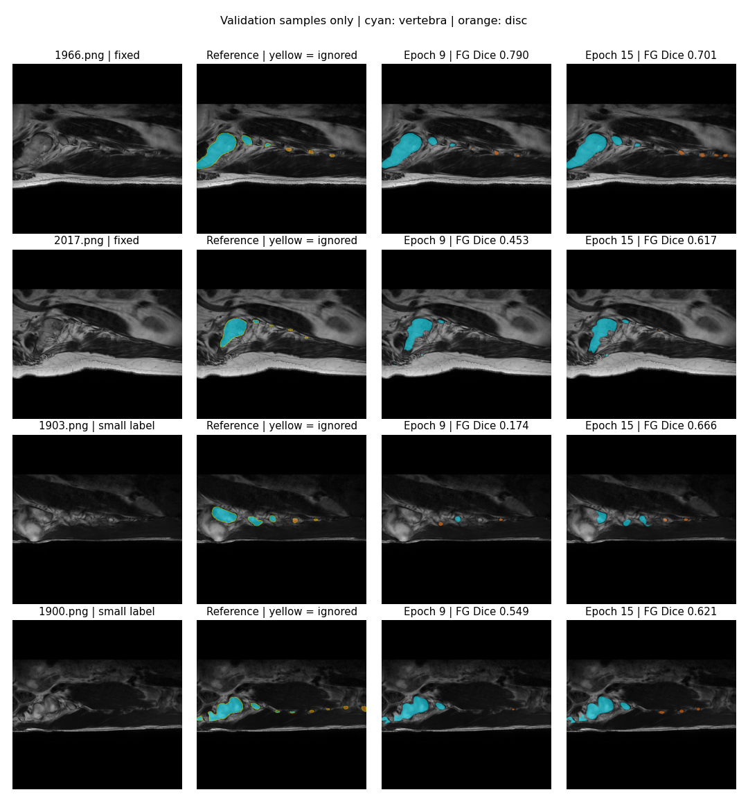

# 已完成的运行记录

所有数字来自实际运行输出。测试和验证单独列出；小规模 smoke 检查不作为性能结果。结构为仓库 J-Unet（25,659,999 参数），输入 512×512，Adam 1e-4、batch 2、Dice loss，随机种子 20260915。训练环境为 Colab T4，PyTorch 2.11.0+cu128、NumPy 2.1.3。

## 全数据 3 轮实验：最终测试

1764 张训练图、253 张验证图、506 张测试图。按验证集前景 Dice 选择第 2 轮模型；保存的 506 张预测 PNG 经独立重算，与程序输出混淆矩阵一致。

| 标签处理 / 汇总 | Dice | mIoU | 像素准确率 |
|---|---:|---:|---:|
| 忽略未知像素，逐图均值，包含背景 | 0.899385 | 0.844058 | 0.985738 |
| 未知像素归背景，逐图均值，包含背景 | 0.851254 | 0.769068 | 0.973782 |
| 忽略未知像素，全局汇总，仅前景 | 0.901950 | 0.821576 | 0.985751 |

以上三行来自同一批预测图；前两列的统计范围不同，不能只挑最大值。像素准确率始终按全部有效类别计算。

## 15 轮实验：验证阶段

这是独立开始的长训练；第 1 轮后发生中断，从保存的断点续跑，达到第 15 轮后按计划暂停。标签策略为 ignore，尚未对这次长训练进行最终测试。

| 完整验证集，全局前景指标 | 第 9 轮（最佳） | 第 15 轮 |
|---|---:|---:|
| Dice | 0.921415 | 0.917702 |
| mIoU | 0.854636 | 0.848462 |

训练损失下降，但验证结果有波动；不能假定增加轮数一定改善性能。

## 预测图抽查

按文件序号等间隔选 6 张验证切片，另取 2 张参考前景面积最小且非空的切片。抽样规则不依赖预测分数。CPU FP32 推理，与训练时 GPU AMP 可能存在轻微数值差异。仅用于定性检查，不代替完整验证。

每行依次为原图、参考标签、第 9 轮预测、第 15 轮预测。青色为椎体、橙色为椎间盘，黄色为忽略的非标准标签像素。

较清晰的大结构整体接近参考标签，小区域存在明显漏分与误分。例如 1903.png 的前景 Dice 从 0.1742 改善到 0.6656，而 1966.png 从 0.7901 降到 0.7008，显示局部改善和退步并存。

数据不含患者编号，不能核实患者独立划分；约 1.6%–1.7% 标签像素颜色不标准。评价对象是现有 PNG 标签，不代表标签已经过独立审核。

完整逐轮指标、样例评分与三轮测试复核信息：[metrics.json](results/metrics.json)。
